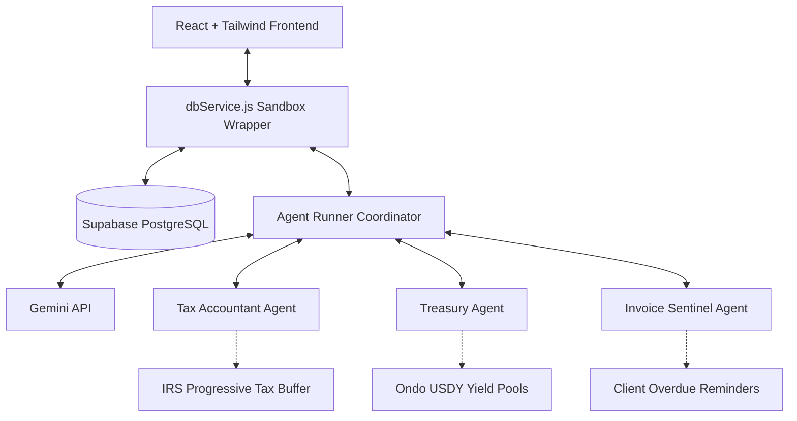

# Singular — AI-Driven Treasury & Finance for the Company of One

Singular is the enterprise treasury and back-office infrastructure engineered specifically for the freelance and creator economy.

---

## 💡 The Core Question

> **"How can a solo developer, creator, or independent consultant scale their business without the administrative overhead of a finance director, a tax accountant, and a collections clerk?"**

### The Solution: Singular

Singular flips the traditional corporate paradigm by providing a **stateful, agentic back-office engine**. By orchestrating autonomous specialized agents over a real-time ledger, Singular automates cash-flow forecasting, tax bracket shoring, yield routing, and payment chasing—acting as a virtual finance department so solo businesses can focus purely on execution.

---

## 🏛️ Technical Architecture

Singular is structured as a real-time, event-driven ledger system controlled by cooperative autonomous agents.



### Architectural Layers

1. **Client Interface & Sandbox Wrapper (`dbService.js`)**:
   - Manages stateful calculations (YTD income, Runway estimation).
   - Simulates invoice payments, receipt uploads, client cancellations, and yield recall events.
   
2. **Cooperative Agent Runner (`agentRunner.js`)**:
   - Evaluates user inquiries and automatically routes execution to the correct agent node.
   - Manages tools registration, ledger sandboxing, and context assemblies.

3. **Specialized Agent Nodes**:
   - **💼 Tax Accountant Agent**: Extracts metadata from uploaded receipts (category, eligible write-offs), recalculates tax bracket liability, and routes savings to tax buffer reserves.
   - **🏦 Treasury Agent**: Monitores runway buffer caps. If liquid cash exceeds targets, it sweeps excess capital into yield pools (like Ondo USDY). In the event of a simulated client cancellation, it automatically projects cash stress-tests.
   - **✉️ Invoice Sentinel Agent**: Scans the accounts receivable ledger for 14+ day overdue client invoices, compiles escalation records, and generates contextual reminder email drafts.

4. **Data Sync Layer (Supabase)**:
   - Uses Supabase to store profile limits, invoices, transactions, and system logs.

5. **AI Reasoning Engine (Gemini)**:
   - Direct integration with Gemini API to classify expenses, audit eligibility, run stress-tests, and adapt the tone of collections correspondence.

---

## 🚀 Tech Stack

- **Framework**: React 18 + Vite (SPA)
- **Styling**: Tailwind CSS + Custom HSL Glassmorphic theme
- **Database / Backend**: Supabase (PostgreSQL)
- **AI Models**: Gemini API
- **Icons & Motion**: Lucide React + CSS micro-animations

---

## 🛠️ Getting Started

### Prerequisites

- Node.js (v18+)
- A Supabase Project
- A Gemini API Key

### Installation

1. Clone the repository:
   ```bash
   git clone https://github.com/Dev-angPatil/Singular.git
   cd Singular
   ```

2. Install dependencies:
   ```bash
   npm install
   ```

3. Configure your local environment variables (`.env`):
   ```env
   VITE_SUPABASE_URL=your_supabase_project_url
   VITE_SUPABASE_ANON_KEY=your_supabase_anon_key
   VITE_GEMINI_API_KEY=your_gemini_api_key
   ```

4. Run the development server:
   ```bash
   npm run dev
   ```

5. Build for production:
   ```bash
   npm run build
   ```
